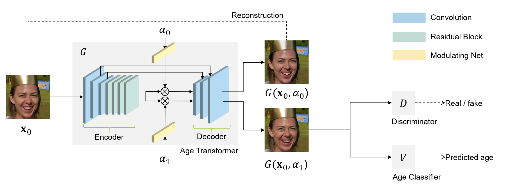
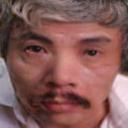

# VinBigdata Vietnamese Face Aging

## Introduction
This repository is based on the ["High Resolution Face Age Editing"](https://arxiv.org/pdf/2005.04410v1.pdf) paper and original repository [HRFAE](https://github.com/InterDigitalInc/HRFAE). The goal of the model is to take an input image with any age and produce an output image with a specified age. Due to resource constraints, we could only train the model on 128x128 resolution images instead of the 1024x1024 resolution mentioned in the paper. During experimentation, we discovered that the model architecture was better suited for high-resolution images, and when trained on 128x128 images, it performed poorly.

We then considered two options:

- Directly modifying the model architecture to better suit low-quality images.
- Using pre-trained weights from the 1024x1024 image training and continuing training with 128x128 images.

In this repository, we have implemented training the model using weights pre-trained on 1024x1024 images.



## Train model
### Dataset
We trained the model on [Vietnamese Celeb faces dataset](https://drive.google.com/file/d/1kpxjaz3pIMrAhEjm7hJxcBsxKNhfl8t2/view)
To acquire training data, we proceed as follows:

```bash
cd data/
bash download.sh
```

### Weights
To obtain the trained model weights, follow these steps:

```bash
cd weights/
bash download.sh
```

### Training
To train the model, follow these steps:
```bash
cd src/
pip install requirements.txt
python train.py
```

## Inference
To perform inference with the model, follow these steps:
1. Place the images you want to infer from into the "test/input" directory.

2. Run the following shell script commands.
    ```bash
        cd src/
        python test.py
    ```
3. The output images are saved in the "test/output" directory
## Result

The image pairs below consist of real images on the left and images generated by the model at the age of 65 on the right.

   

The image pairs below consist of real images on the left and images generated by the model at the age of 25 on the right.

   